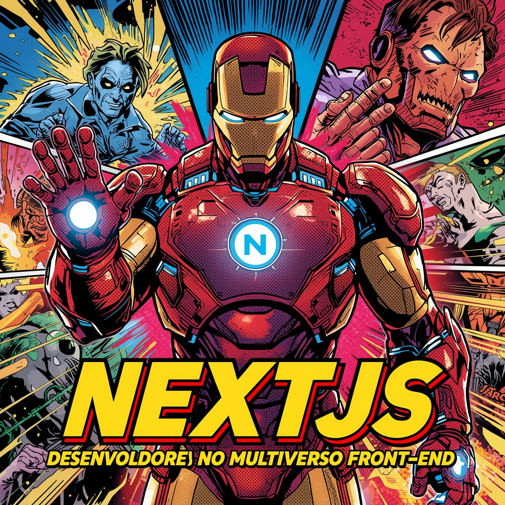

-------

# 📘 Frameworks para Heróis do Front End

> ✨ Um ebook criado por **Caio Martins** com o poder das IAs.  
> Descubra como o **Next.js** pode transformar o desenvolvimento front-end com rotas automáticas, renderização híbrida e deploy instantâneo.  
> Gerado com o auxílio de **ChatGPT**, ilustrado no **Leonardo.Ai** e diagramado no **Gamma.App**.

📕 **[Clique aqui para ler o ebook completo (PDF)](https://github.com/Caaio-Martins/prompts-recipe-to-create-a-ebook-DIO/blob/main/output/ebook-Frameworks-para-Herois-do-Front-End.pdf)**

---

## 💻 Tecnologias Utilizadas

- [ChatGPT](https://chat.openai.com/) — geração do conteúdo e estrutura textual  
- [Leonardo.Ai](https://leonardo.ai/) — criação de ilustrações e capa  
- [Gamma.App](https://gamma.app/) — diagramação e design do ebook  
- [Next.js](https://nextjs.org/) — tema principal do conteúdo  

---

## 🧠 Prompts Utilizados

### ChatGPT：

| Ação | Prompt |
| :--: | :------ |
| **Título** | Crie um título épico e curto para um ebook sobre frameworks front-end, com temática de heróis, focando no Next.js. Liste 5 variações criativas. |
| **Conteúdo** | Escreva um texto explicando os principais recursos do Next.js (rotas automáticas, SSR, SSG, ISR, API Routes, otimização de imagens e deploy com Vercel). Use linguagem inspiradora, exemplos práticos e tom didático. |

### Leonardo.Ai：

| Ação | Prompt |
| :--: | :------ |
| **Capa** | A team of futuristic front-end heroes coding with glowing energy, inspired by Avengers, surrounded by holographic code screens, cinematic lighting, vibrant colors, digital art style --ar 16:9 |

---

## ✨ Destaques do Ebook

- ⚡ **Rotas Automáticas** — Cada arquivo `pages/` vira uma rota instantânea  
- 🔁 **Renderização Híbrida** — Combine SSR, SSG e ISR  
- 🔗 **API Integrada** — Crie endpoints sem servidor extra  
- 🖼️ **Next/Image** — Imagens otimizadas e leves  
- 🌍 **SEO Integrado** — Controle de `<head>`, Open Graph e Sitemap  
- ☁️ **Deploy Instantâneo** — CI/CD nativo via Vercel  

---

## 🛠️ Como Reproduzir

1. Gere o conteúdo textual com os prompts no **ChatGPT**.  
2. Crie as imagens com o **Leonardo.Ai**.  
3. Monte e formate o ebook no **Gamma.App**.  
4. Exporte o resultado final como PDF e publique neste repositório.  

---

## 👨‍💻 Autor

    
    
&nbsp;&nbsp;&nbsp;<strong>Caio Martins</strong> 
    &nbsp;&nbsp;&nbsp;
    <a href="https://github.com/Caaio-Martins">GitHub</a> &nbsp;|&nbsp;
    <a href="https://www.linkedin.com/in/dev-caio-martins/">LinkedIn</a> &nbsp;|&nbsp;
    

---

⌨️ por [Caio Martins](https://github.com/Caaio-Martins)
